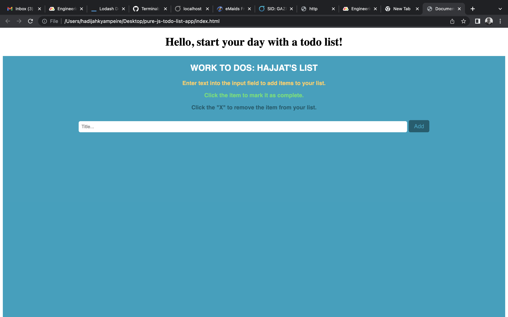
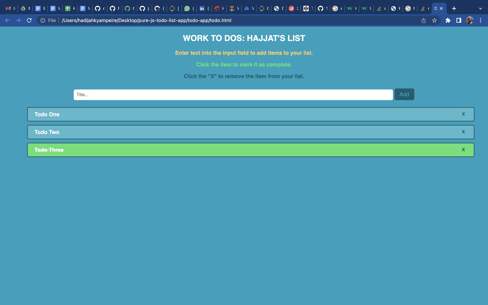

# pure-js-todo-list-app
My pure JS and html todolist app

## Live Demo on Github pages
- [Todo App](https://hadijahkyampeire.github.io/pure-js-todo-list-app/)
## Todo functionalities
- Create a tod item
- Mark todo as done
- Delete todo

## Index page

## The App UI
